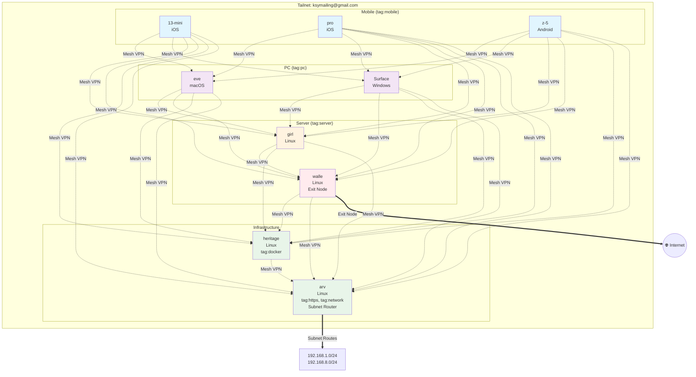

# Tailscale 네트워크 다이어그램

생성일: 2026-03-09

## 네트워크 topology

## 태그별 디바이스 분류

| 태그 | 디바이스 | 수량 |
|------|----------|------|
| `tag:mobile` | 13-mini, pro, z-5 | 3대 |
| `tag:pc` | eve, Surface | 2대 |
| `tag:server` | girl, walle | 2대 |
| `tag:docker` | heritage | 1대 |
| `tag:https` | arv | 1대 |
| `tag:network` | arv | 1대 |

## 네트워크 기능

### 🔐 Private Mesh VPN
- 모든 디바이스 간 P2P 연결
- 전체 암호화 통신

### 🌐 Exit Node
- **walle**: 인터넷 트래픽 라우팅 가능

### 🌐 Subnet Router
- **arv**: 192.168.1.0/24, 192.168.8.0/24 네트워크 노출

### 🔌 Tailscale Funnel
- **arv** (tag:https): 443 포트 공개

### 📁 파일 공유 (Taildrop)
- **tag:server**, **tag:pc**: 파일 수신 가능

