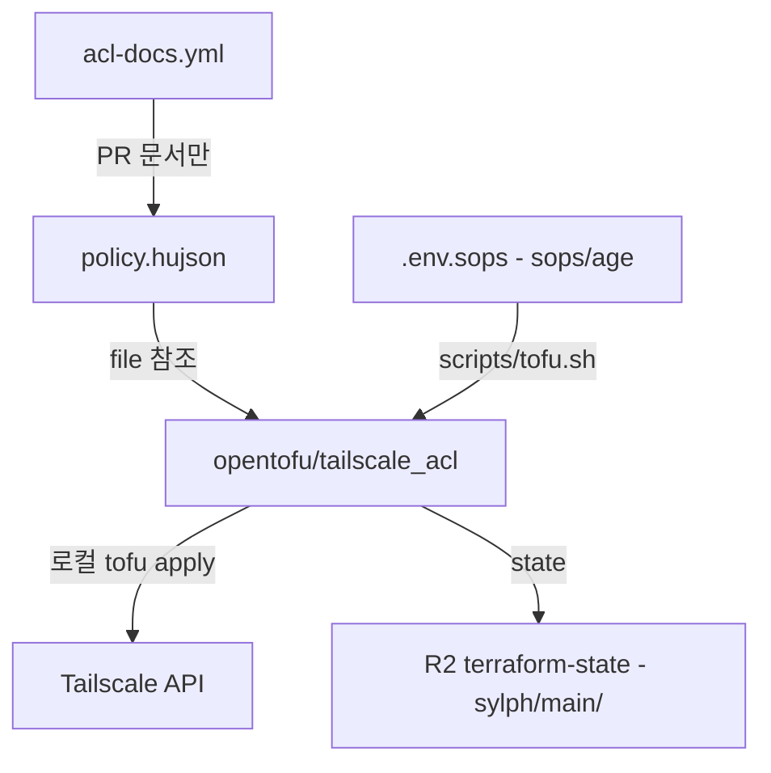

# Tailscale 관리 OpenTofu 일원화 설계

> **Date**: 2026-07-25
> **Status**: Approved

## 목표

Tailscale tailnet 관리를 OpenTofu(cloud-init) + Ansible 기반 인프라 관리 체계에 일원화한다.
기존 GitOps(`tailscale/gitops-acl-action`) 방식을 폐기하고, ACL policy를 포함한 tailnet 설정을
OpenTofu로 선언적 관리한다.

## 배경

- 기존: `policy.hujson` → PR → GitHub Actions(`tailscale-acl.yml`) → ACL apply (GitOps)
- 문제: 디바이스 tag 부여는 API/스크립트(`tag-device.sh`)로 별도 수행 — 관리 체계 이원화
- 사용자의 기존 인프라: homelab에서 OpenTofu + R2 state backend(`terraform-state` bucket) 운영 중

## 설계 결정사항

| 항목 | 결정 | 근거 |
| :--- | :--- | :--- |
| ACL 관리 | OpenTofu `tailscale_acl`로 완전 이전 | 완전 일원화. `acl = file(...)`로 HuJSON 통째 관리해 기존 diff 리뷰 경험 유지 |
| GitOps 워크플로우 | `tailscale-acl.yml` 제거 | OpenTofu와 동시 apply 충돌 방지. 같은 변경에서 제거 |
| 문서 워크플로우 | `acl-docs.yml` 유지 | `policy.hujson`이 source로 남으므로 PR 문서 코멘트는 계속 동작 |
| State backend | R2 `terraform-state` bucket, key `sylph/main/terraform.tfstate` | homelab 컨벤션(`homelab/dev/terraform.tfstate`)과 동일 패턴. bucket 공유 |
| apply 실행 위치 | 로컬 (향후 GitHub Actions 전환 여지) | sops 자격증명 일원 관리. Actions 전환은 별도 작업 |
| 자격증명 로드 | wrapper script `scripts/tofu.sh` | backend는 provider보다 먼저 평가되어 sops provider 사용 불가 → shell env 주입. `tag-device.sh`와 동일 패턴 |
| `tag-device.sh` | 유지 (fallback) | OpenTofu 미관리 디바이스용. `device_tags`로 관리되는 디바이스에는 사용 금지 |

## 아키텍처



## 디렉토리 구조

```text
sylph/
├── policy.hujson          # ACL source (유지 — file() 참조)
├── .env.sops              # TS OAuth + R2 키 (확장)
├── opentofu/
│   ├── backend.tf         # R2 backend (sylph/main/terraform.tfstate)
│   ├── versions.tf        # tailscale + sops provider
│   ├── main.tf            # tailscale_acl, provider 설정
│   └── devices.tf         # tailscale_device_tags (projector 등)
├── scripts/
│   ├── tofu.sh            # sops 로드 wrapper (신규)
│   ├── tag-device.sh      # 유지 — fallback
│   └── generate-docs.sh   # 유지 (변경 없음)
└── .github/workflows/
    ├── acl-docs.yml       # 유지 (PR 문서 코멘트)
    └── tailscale-acl.yml  # 제거
```

## 상세 설계

### backend.tf

homelab `backend.tf`와 동일 구조, key만 변경:

```hcl
terraform {
  backend "s3" {
    endpoints = {
      s3 = "https://e0924c382d21ac0f10aee606b82687ce.r2.cloudflarestorage.com"
    }
    bucket                      = "terraform-state"
    key                         = "sylph/main/terraform.tfstate"
    region                      = "auto"
    skip_credentials_validation = true
    skip_region_validation      = true
    skip_requesting_account_id  = true
    skip_metadata_api_check     = true
    skip_s3_checksum            = true
    use_path_style              = true
  }
}
```

### versions.tf

```hcl
terraform {
  required_version = ">= 1.8"
  required_providers {
    tailscale = {
      source  = "tailscale/tailscale"
      version = "~> 0.24"
    }
  }
}
```

> provider 버전은 구현 시 최신 stable 확인 후 고정.

### main.tf

```hcl
provider "tailscale" {
  # env: TAILSCALE_OAUTH_CLIENT_ID / TAILSCALE_OAUTH_CLIENT_SECRET / TAILSCALE_TAILNET
  tailnet = "TY1qnFMXke11CNTRL"
}

resource "tailscale_acl" "acl" {
  acl = file("${path.module}/../policy.hujson")
}
```

### devices.tf

```hcl
data "tailscale_devices" "all" {}

locals {
  device_by_hostname = { for d in data.tailscale_devices.all.devices : d.hostname => d }
}

resource "tailscale_device_tags" "projector" {
  device_id = local.device_by_hostname["ADT-3"].id
  tags      = ["tag:projector"]
}
```

> projector의 실제 hostname은 `ADT-3` (Tailscale 커스텀 네임과 다름).
> 신규 디바이스는 이 파일에 resource 추가로 관리.

### scripts/tofu.sh

```bash
#!/bin/bash
# sops로 .env.sops 복호화 → env 주입 → tofu 실행
# 사용: ./scripts/tofu.sh plan|apply|...
set -euo pipefail
cd "$(dirname "$0")/../opentofu"

ENV_TMP=$(mktemp)
trap 'rm -f "$ENV_TMP"' EXIT
sops -d --input-type dotenv --output-type binary ../.env.sops > "$ENV_TMP"
set -a; source "$ENV_TMP"; set +a

export TAILSCALE_OAUTH_CLIENT_ID="$TS_API_CLIENT_ID"
export TAILSCALE_OAUTH_CLIENT_SECRET="$TS_API_CLIENT_SECRET"
export TAILSCALE_TAILNET="TY1qnFMXke11CNTRL"

tofu "$@"
```

### .env.sops 확장

기존 `TS_API_CLIENT_ID` / `TS_API_CLIENT_SECRET`에 R2 키 추가:

```text
TS_API_CLIENT_ID=...
TS_API_CLIENT_SECRET=...
AWS_ACCESS_KEY_ID=...        # R2 access key
AWS_SECRET_ACCESS_KEY=...    # R2 secret key
```

> R2 키는 homelab과 동일 키 재사용 (사용자 확인 완료).

## 마이그레이션 절차

1. `opentofu/` scaffold + `scripts/tofu.sh` 작성
2. `.env.sops`에 R2 키 추가 (sops 재암호화)
3. `./scripts/tofu.sh init` — R2 backend 초기화
4. `./scripts/tofu.sh import tailscale_acl.acl acl` — 기존 ACL state 흡수
5. `./scripts/tofu.sh import tailscale_device_tags.projector nE7nEXsjp211CNTRL` — projector tag state 흡수
6. `./scripts/tofu.sh plan` — **diff 0 확인** (무결성 검증 포인트)
7. `tailscale-acl.yml` 제거 + RULES.md 갱신 커밋
8. 이후 ACL 변경: `policy.hujson` 수정 → `./scripts/tofu.sh plan/apply`

## 검증 기준

- `tofu plan` diff 0 (import 후)
- `tailscale status`에서 projector의 `tag:projector` 유지 확인
- `policy.hujson` 사소한 변경(주석 추가)으로 plan → apply → Tailscale 반영 확인
- GitHub Actions에 `tailscale-acl.yml`이 더 이상 실행되지 않음

## 비목표 (YAGNI)

- GitHub Actions 자동 apply — 별도 후속 작업
- DNS 설정(`tailscale_dns_*`), OAuth client IaC화 — 필요 시 추가
- Ansible 측 작업 (노드 설치/inventory) — 이번 범위 아님
- `tag-device.sh` 제거 — fallback으로 유지
