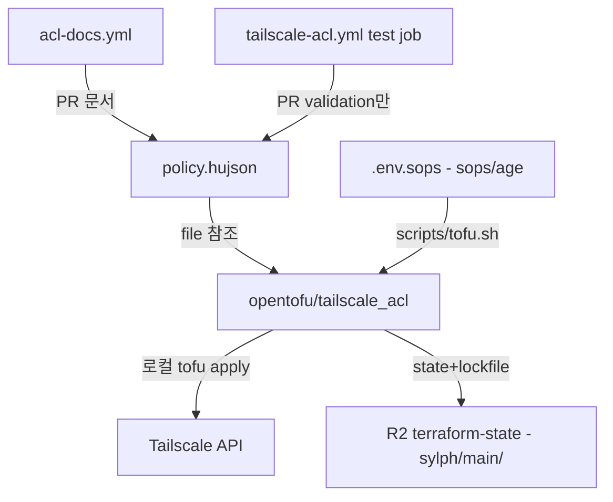

# Tailscale 관리 OpenTofu 일원화 설계

> **Date**: 2026-07-25
> **Status**: Approved → Review 반영 (Codex + agy 교차검증 v2)

## 목표

Tailscale tailnet 관리를 OpenTofu(cloud-init) + Ansible 기반 인프라 관리 체계에 일원화한다.
기존 GitOps(`tailscale/gitops-acl-action`)의 apply를 폐기하고, ACL policy를 포함한 tailnet 설정을
OpenTofu로 선언적 관리한다.

## 배경

- 기존: `policy.hujson` → PR → GitHub Actions(`tailscale-acl.yml`) → ACL test + apply (GitOps)
- 문제: 디바이스 tag 부여는 API/스크립트(`tag-device.sh`)로 별도 수행 — 관리 체계 이원화
- 사용자의 기존 인프라: homelab에서 OpenTofu + R2 state backend(`terraform-state` bucket) 운영 중

## 설계 결정사항

| 항목 | 결정 | 근거 |
| :--- | :--- | :--- |
| ACL 관리 | OpenTofu `tailscale_acl`로 완전 이전 | 완전 일원화. `acl = file(...)`로 HuJSON 통째 관리해 기존 diff 리뷰 경험 유지 |
| GitOps apply | `tailscale-acl.yml`의 **apply job만 제거** | OpenTofu와 동시 apply 충돌 방지. PR test(validation) job은 유지 — server-side policy 검증 gate 보존 |
| 문서 워크플로우 | `acl-docs.yml` 유지 | `policy.hujson`이 source로 남으므로 PR 문서 코멘트는 계속 동작 |
| State backend | R2 `terraform-state` bucket, key `sylph/main/terraform.tfstate`, `use_lockfile = true` | homelab 컨벤션과 동일 패턴. OpenTofu ≥1.10 lockfile로 동시 실행 방지 (R2 conditional write 지원) |
| apply 실행 위치 | 로컬 (향후 GitHub Actions 전환 여지) | sops 자격증명 일원 관리. Actions 전환은 별도 작업 |
| 자격증명 로드 | wrapper script `scripts/tofu.sh` | backend는 provider보다 먼저 평가되어 sops provider 사용 불가 → shell env 주입. `tag-device.sh`와 동일 패턴 |
| `tag-device.sh` | 유지 (fallback) | OpenTofu 미관리 디바이스용. `device_tags`로 관리되는 디바이스에는 사용 금지 |
| `device_tags` invariant | 해당 resource가 디바이스 tag의 **유일한 owner** | resource는 전체 tag set을 교체. 선언 외 tag는 apply 시 삭제됨 |

## 아키텍처



## 디렉토리 구조

```text
sylph/
├── policy.hujson          # ACL source (유지 — file() 참조)
├── .env.sops              # TS OAuth + R2 키 (확장)
├── opentofu/
│   ├── backend.tf         # R2 backend + use_lockfile
│   ├── versions.tf        # tailscale provider pin
│   ├── main.tf            # tailscale_acl, provider 설정
│   ├── devices.tf         # tailscale_device_tags (projector 등)
│   └── .terraform.lock.hcl  # 커밋 (재현성)
├── scripts/
│   ├── tofu.sh            # sops 로드 wrapper (신규)
│   ├── tag-device.sh      # 유지 — fallback
│   └── generate-docs.sh   # 유지 (변경 없음)
└── .github/workflows/
    ├── acl-docs.yml       # 유지 (PR 문서 코멘트)
    └── tailscale-acl.yml  # apply job 제거, PR test job만 유지
```

## 상세 설계

### backend.tf

homelab `backend.tf`와 동일 구조 + key 변경 + lockfile 추가:

```hcl
terraform {
  backend "s3" {
    endpoints = {
      s3 = "https://e0924c382d21ac0f10aee606b82687ce.r2.cloudflarestorage.com"
    }
    bucket                      = "terraform-state"
    key                         = "sylph/main/terraform.tfstate"
    region                      = "auto"
    skip_credentials_validation = true
    skip_region_validation      = true
    skip_requesting_account_id  = true
    skip_metadata_api_check     = true
    skip_s3_checksum            = true
    use_path_style              = true
    use_lockfile                = true  # OpenTofu >= 1.10
  }
}
```

### versions.tf

```hcl
terraform {
  required_version = ">= 1.10"  # use_lockfile 요구. 로컬 1.12.5 확인됨
  required_providers {
    tailscale = {
      source  = "tailscale/tailscale"
      version = "0.29.2"  # 구현 시 최신 stable 확인 후 exact pin
    }
  }
}
```

> exact pin + `.terraform.lock.hcl` 커밋으로 재현성 확보 (pre-1.0 provider는 범위 지정 비권장).

### main.tf

```hcl
provider "tailscale" {
  # env로 일원화: TAILSCALE_OAUTH_CLIENT_ID / TAILSCALE_OAUTH_CLIENT_SECRET / TAILSCALE_TAILNET
}

resource "tailscale_acl" "acl" {
  acl = file("${path.module}/../policy.hujson")
}
```

> `tailscale_acl`은 plan 단계에서 Tailscale API가 policy를 검증 (syntax/test 실패 시 apply 전 노출).
> 변경 적용 전 import가 필수 (`overwrite_existing_content`는 사용하지 않음).

### devices.tf

```hcl
data "tailscale_device" "projector" {
  hostname = "ADT-3"
}

resource "tailscale_device_tags" "projector" {
  device_id = data.tailscale_device.projector.node_id
  tags      = ["tag:projector"]
}
```

> - projector의 실제 hostname은 `ADT-3` (Tailscale 커스텀 네임과 다름)
> - `node_id` 사용 (`id`는 v0.24부터 legacy)
> - 단일 device data source 사용 — list-to-map 방식은 hostname 중복 시 duplicate-key error
> - 신규 디바이스는 이 파일에 resource 추가로 관리

### scripts/tofu.sh

```bash
#!/bin/bash
# sops로 .env.sops 복호화 → env 주입 → tofu 실행
# 사용: ./scripts/tofu.sh plan|apply|...
set -euo pipefail
cd "$(dirname "$0")/../opentofu"

ENV_TMP=$(mktemp)
trap 'rm -f "$ENV_TMP"' EXIT
sops -d --input-type dotenv --output-type binary ../.env.sops > "$ENV_TMP"
set -a; source "$ENV_TMP"; set +a

export TAILSCALE_OAUTH_CLIENT_ID="$TS_API_CLIENT_ID"
export TAILSCALE_OAUTH_CLIENT_SECRET="$TS_API_CLIENT_SECRET"
export TAILSCALE_TAILNET="TY1qnFMXke11CNTRL"

tofu "$@"
```

### .env.sops 확장

기존 `TS_API_CLIENT_ID` / `TS_API_CLIENT_SECRET`에 R2 키 추가:

```text
TS_API_CLIENT_ID=...
TS_API_CLIENT_SECRET=...
AWS_ACCESS_KEY_ID=...        # R2 access key
AWS_SECRET_ACCESS_KEY=...    # R2 secret key
```

> R2 키는 homelab과 동일 키 재사용 (사용자 확인 완료).

### .gitignore 추가

```gitignore
# OpenTofu
.terraform/
*.tfstate
*.tfstate.*
crash.log
```

> `.terraform.lock.hcl`은 ignore하지 않고 커밋.

### OAuth client scope 요구사항

| scope | 용도 |
| :--- | :--- |
| `policy_file` write | `tailscale_acl` 조회/검증/수정 |
| `devices:core` write | `tailscale_device_tags` tag 변경 |
| `devices:core` read | 디바이스 조회 (data source) |

> 사용자가 sylph용 OAuth client에 모든 권한 부여 완료. 마이그레이션 preflight에서
> `GET /api/v2/tailnet/{tailnet}/acl` 호출로 실제 scope를 검증한다 (403 시 재발급).

## 마이그레이션 절차

### Phase 1: Baseline (사전 기록)

1. live policy를 API에서 export → `policy.hujson`과 비교 (drift 확인)
2. projector node ID(`nE7nEXsjp211CNTRL`)와 현재 tags(`["tag:projector"]`) 기록
3. R2에 `sylph/main/terraform.tfstate` key가 비어있는지 확인 (기존 state 충돌 방지)
4. OAuth scope 검증 (`GET .../acl` 200 확인)

### Phase 2: Scaffold + Import

5. `opentofu/` scaffold + `scripts/tofu.sh` 작성, `.gitignore` 추가
6. `.env.sops`에 R2 키 추가 (sops 재암호화)
7. `./scripts/tofu.sh init` — R2 backend 초기화
8. `./scripts/tofu.sh import tailscale_acl.acl acl` — 기존 ACL state 흡수
9. `./scripts/tofu.sh import tailscale_device_tags.projector nE7nEXsjp211CNTRL`

### Phase 3: 검증 + Cutover

10. `./scripts/tofu.sh plan` — **diff 0 확인. diff 발생 시 apply 금지, 원인 분석 후 재시도**
11. `tailscale-acl.yml`에서 apply job 제거 (test job 유지) + RULES.md/README 갱신 커밋
12. 이후 ACL 변경: `policy.hujson` 수정 → `./scripts/tofu.sh plan/apply`

> **Stop conditions**: Phase 3 plan에서 예상 외 diff, import 실패, 403/401 발생 시
> 중단하고 원인 분석. apply는 diff 0 확인 후에만.

## 검증 기준

- `tofu plan` diff 0 (import 후)
- `tailscale status`에서 projector의 `tag:projector` 유지 확인
- `policy.hujson` 사소한 변경(주석 추가)으로 plan → apply → Tailscale 반영 확인
- PR 생성 시 `tailscale-acl.yml` test job만 실행되고 apply는 실행되지 않음

## 비목표 (YAGNI)

- GitHub Actions 자동 apply — 별도 후속 작업
- DNS 설정(`tailscale_dns_*`), OAuth client IaC화 — 필요 시 추가
- Ansible 측 작업 (노드 설치/inventory) — 이번 범위 아님
- `tag-device.sh` 제거 — fallback으로 유지
- R2 state 전용 least-privilege credential 분리 — 강화 옵션, 후속 검토
